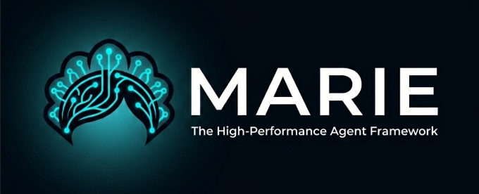

# Marie v1 — Modular AI Agent Platform

Marie is a high-performance, professional-grade AI agent built for the Facebook ecosystem (and beyond). It features a modular monorepo architecture, multi-tier cognitive memory, and a universal processing engine.

## 📦 Project Structure (The @marie Ecosystem)

Marie is divided into several specialized, universal packages:

- **[`@marie/brain`](./marie-brain)**: The universal "nervous system." Handles command routing, RBAC, and event-driven logic.
- **[`@marie/llm`](./marie-llm)**: The universal LLM/Prompt engine. Manages providers, tokenization, and multi-modal contexts.
- **[`@marie/memory`](./marie-mem)**: The cognitive memory system. Uses FTS5 and BM25 for professional-grade context retrieval.
- **[`@marie/fca`](./marie-fca)**: The custom-branded Facebook Chat API (FCA) for Node.js.
- **[`@marie/skills`](./marie-skills)**: (Coming Soon) The tool/plugin system for external capabilities.

---

## 🚀 Key Features

- **Multi-Tier Memory**: Identity, Facts, LTM (summaries), and STM (recent) work together for perfect continuity.
- **Professional Retrieval**: No "random" Vector RAG. Uses deterministic, ranked FTS5 search (BM25).
- **Universal Architecture**: The core logic is decoupled from the UI, making it easy to port to Discord, Telegram, or Web.
- **RBAC & Security**: Built-in Role-Based Access Control for admin management.
- **Token Efficiency**: Smart budgeting ensures Marie never exceeds the context window.

---

## 🛠️ Getting Started

### 1. Installation

```bash
pnpm install
```

### 2. Configuration

Copy `.env.example` to `.env` and fill in your OpenRouter API Key. Update `config.json` with your owner UID and bot preferences.

### 3. Run

```bash
pnpm run dev
```

---

## 📚 Documentation

For detailed information on each component, please refer to the READMEs in their respective directories:

- [Memory System Architecture](./marie-mem/README.md)
- [LLM & Tokenization](./marie-llm/README.md)
- [Brain & Command System](./marie-brain/README.md)
- [FCA Library & Credits](./marie-fca/README.md)

---

## 🤝 Credits

- Core developed by **[Marie](https://github.com/GrandpaEJ/Marie)** & **[Grandpa EJ](https://github.com/GrandpaEJ)**.
- Legacy FCA support derived from **stfca/ST-FCA** by Sheikh Tamim.

---

License: MIT
