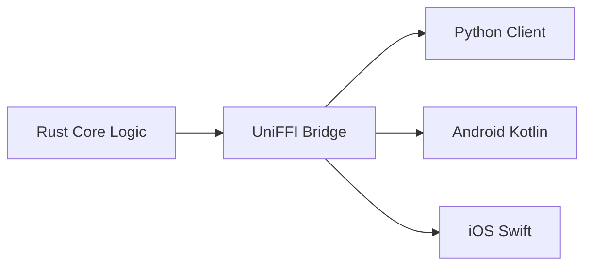

# Universal Marie Core (Rust)

The **Marie Universal Core** is the high-performance "brain" of the agent, written in **Rust**. It provides a single source of truth for agent logic, ensuring consistent behavior across Python, JavaScript, and Mobile platforms.

## Why Rust?

1.  **Safety**: Prevents memory leaks and ensures thread-safety when shared across languages.
2.  **Speed**: Extremely fast history manipulation and budget auditing.
3.  **Portability**: Compiles to a standard shared library (`.so`, `.dll`) or WebAssembly (`WASM`), making it usable on everything from Termux to a Web Browser.

## Key Components

### 1. AgentBrain
The `AgentBrain` is the stateful object that manages:
- **Conversation History**: Stored as a vector of `Message` objects.
- **Budgeting**: Real-time tracking of token usage and USD costs.
- **Safe Mode**: A gatekeeper that decides which tools are allowed to run.

### 2. Models
Structured data models shared across all languages:
- `Message`: Supports `role`, `content`, and complex `tool_calls`.
- `Budget`: Defines `max_tokens`, `max_cost_usd`, and `max_steps`.
- `Metrics`: Provides live snapshots of agent performance.

## The Bridge (UniFFI)

We use **UniFFI** to generate the low-level "glue code" for multiple languages. 



## Building the Core

To build the core and generate bindings for your system, use the provided build script:

```bash
bash build.sh
```

This will:
1. Compile the Rust code in `release` mode.
2. Generate Python bindings in `clients/python/marie/core.py`.
3. Copy the native library into the package.
