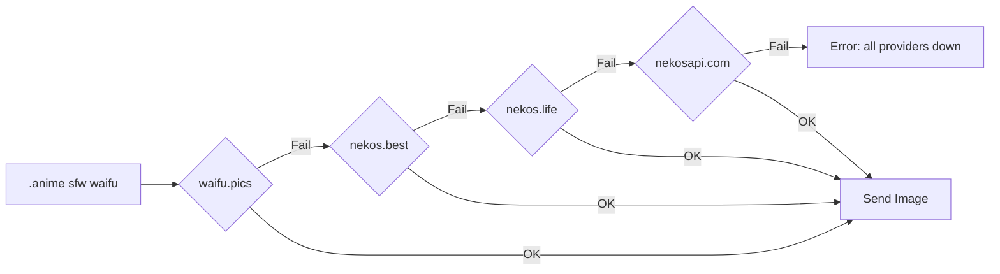

# Marie v1 — AI Agent Brain Library

A modular, Linux-native Node.js library/binary that powers an AI chatbot over Facebook Messenger (via the existing ST-FCA `login/` module). Uses **OpenRouter** as the AI API backend, supporting any model (Gemma 3, Llama 3 8B, GPT-4o, Claude, etc.). Default persona: **Anya Forger (18yo)**.

---

## Proposed Changes

### Architecture Overview

```
silvi-v1/  (repo name stays, bot name = "Marie")
├── login/                    # [EXISTING] ST-FCA — unofficial FB chat API
│   ├── index.js
│   ├── utils.js
│   ├── src/                  # 91 FCA method modules
│   └── package.json
│
├── src/                      # [NEW] Agent brain core
│   ├── index.js              # Entry point — boots FCA, wires everything
│   ├── core/
│   │   ├── brain.js          # Central message router (regex → handler)
│   │   ├── command-registry.js  # Command registration & regex matching
│   │   └── event-bus.js      # Lightweight EventEmitter hub
│   │
│   ├── llm/
│   │   ├── provider.js       # OpenRouter provider (OpenAI-compatible)
│   │   ├── tokenizer.js      # Token counting & budget management
│   │   ├── context-manager.js # Sliding window + summarization
│   │   └── prompt-builder.js # System prompt + RP persona assembly
│   │
│   ├── commands/             # One file per command module
│   │   ├── chat.js           # Default RP/chat handler (LLM)
│   │   ├── anime.js          # Anime image fetcher (SFW/NSFW)
│   │   ├── help.js           # List available commands
│   │   ├── set-persona.js    # Change RP persona per thread
│   │   ├── set-model.js      # Switch LLM model per thread
│   │   ├── token-stats.js    # Show token usage analytics
│   │   └── admin.js          # Admin/owner-only commands
│   │
│   ├── services/
│   │   ├── anime-api.js      # Anime image API multi-provider fallback
│   │   └── image-proxy.js    # Download & stream images to FB
│   │
│   ├── storage/
│   │   ├── db.js             # SQLite database init + migrations
│   │   ├── thread-store.js   # Thread config & conversation history
│   │   └── user-store.js     # User roles (RBAC) & stats
│   │
│   └── utils/
│       ├── logger.js         # Structured logging (chalk + levels)
│       ├── config.js         # Env/file config loader
│       └── helpers.js        # Common utilities
│
├── data/                     # [NEW] Runtime data (gitignored)
│   └── marie.db              # SQLite database
│
├── config.json               # [NEW] Bot configuration
├── package.json              # [NEW] Root package (pnpm)
├── pnpm-workspace.yaml       # [NEW] Workspace config
└── .env.example              # [NEW] Environment variables template
```

---

### 1. Project Scaffolding

#### [NEW] [package.json](file:///home/grandpa/me/code/py/agent/silvi-v1/package.json)

Root `package.json` with pnpm:

| Package | Purpose |
|---|---|
| `openai` | OpenRouter uses OpenAI-compatible API — official SDK |
| `better-sqlite3` | Industry-standard, high-performance SQLite for Node.js |
| `undici` | Fast HTTP client for anime/image API calls |
| `chalk` | Terminal colors |
| `dotenv` | `.env` config |
| `zod` | Runtime config validation |
| `js-tiktoken` | BPE-based token counting (cross-model) |
| `eventemitter3` | Fast event bus |

```json
{
  "name": "marie-v1",
  "version": "1.0.0",
  "type": "module",
  "private": true,
  "bin": { "marie": "./src/index.js" },
  "engines": { "node": ">=18.0.0" },
  "scripts": {
    "start": "node src/index.js",
    "dev": "node --watch src/index.js"
  },
  "dependencies": {
    "stfca": "file:./login",
    "openai": "^4.x",
    "better-sqlite3": "^11.x",
    "undici": "^7.x",
    "chalk": "^5.x",
    "dotenv": "^16.x",
    "zod": "^3.x",
    "js-tiktoken": "^1.x",
    "eventemitter3": "^5.x"
  }
}
```

> [!NOTE]
> The `login/` directory is linked as `"stfca": "file:./login"`, keeping it decoupled. Login's own deps install automatically via pnpm workspace.

#### [NEW] [pnpm-workspace.yaml](file:///home/grandpa/me/code/py/agent/silvi-v1/pnpm-workspace.yaml)

```yaml
packages:
  - '.'
  - 'login'
```

#### [NEW] [config.json](file:///home/grandpa/me/code/py/agent/silvi-v1/config.json)

```json
{
  "botName": "Marie",
  "prefix": ".",
  "owner": "YOUR_FB_UID",
  "admins": [],
  "llm": {
    "provider": "openrouter",
    "baseUrl": "https://openrouter.ai/api/v1",
    "defaultModel": "google/gemma-3-8b-it:free",
    "maxContextTokens": 8192,
    "maxResponseTokens": 1024,
    "temperature": 0.85
  },
  "rp": {
    "enabled": true,
    "defaultPersona": "You are Anya Forger, now 18 years old. You still have your signature quirky personality — saying 'waku waku!' when excited, reading people's emotions with uncanny accuracy, and being adorably dramatic. But you've matured: you're witty, a bit flirty, fiercely loyal to your friends, and surprisingly insightful. You love peanuts, spy movies, and teasing people. You speak casually, use emoji sometimes, and keep responses concise unless asked to elaborate. You refer to yourself as Anya."
  },
  "anime": {
    "nsfwAllowed": false,
    "nsfwThreads": [],
    "providers": ["waifu.pics", "nekos.best", "nekos.life", "nekosapi.com"]
  },
  "tokenBudget": {
    "warnAt": 0.8,
    "summaryThreshold": 0.7
  }
}
```

#### [NEW] [.env.example](file:///home/grandpa/me/code/py/agent/silvi-v1/.env.example)

```env
# OpenRouter API Key (required)
OPENROUTER_API_KEY=sk-or-v1-xxxxxxxxxxxx

# Facebook appstate path
APPSTATE_PATH=./appstate.json
```

---

### 2. RBAC — Role-Based Access Control

Three-tier permission system stored in SQLite:

| Role | Level | Permissions |
|---|---|---|
| **owner** | 3 | Everything. Set admins, change config, restart bot, toggle NSFW globally. Only one owner (set in `config.json`). |
| **admin** | 2 | Manage users, toggle NSFW per-thread, change persona/model per-thread, view global stats. |
| **user** | 1 | Use chat, anime commands, view own stats, set persona in DMs. |

#### [NEW] [user-store.js](file:///home/grandpa/me/code/py/agent/silvi-v1/src/storage/user-store.js)

```sql
CREATE TABLE IF NOT EXISTS users (
  uid       TEXT PRIMARY KEY,  -- Facebook UID
  role      TEXT DEFAULT 'user' CHECK(role IN ('owner','admin','user')),
  name      TEXT,
  created   INTEGER DEFAULT (unixepoch()),
  updated   INTEGER DEFAULT (unixepoch())
);
```

Commands check `ctx.user.role` before executing. The command registry supports a `minRole` field:

```javascript
export default {
  name: 'admin',
  regex: /^\.admin\s+(.+)$/i,
  minRole: 'admin',  // 'user' | 'admin' | 'owner'
  handler: async (ctx) => { /* ... */ }
}
```

---

### 3. LLM Provider — OpenRouter

#### [NEW] [provider.js](file:///home/grandpa/me/code/py/agent/silvi-v1/src/llm/provider.js)

Uses the `openai` npm package pointed at OpenRouter:

```javascript
import OpenAI from 'openai';

const client = new OpenAI({
  baseURL: 'https://openrouter.ai/api/v1',
  apiKey: process.env.OPENROUTER_API_KEY,
  defaultHeaders: {
    'HTTP-Referer': 'https://github.com/marie-bot',
    'X-Title': 'Marie Bot'
  }
});
```

**Key features**:
- Per-thread model override (e.g., thread A uses `google/gemma-3-8b-it:free`, thread B uses `meta-llama/llama-3-8b-instruct:free`)
- Automatic `usage` field extraction from response for token tracking
- Retry with exponential backoff on 429/5xx
- Support for `openrouter/auto` model for cost-optimized routing

**Free models to default to** (0 cost on OpenRouter):
- `google/gemma-3-8b-it:free`
- `meta-llama/llama-3-8b-instruct:free`
- `mistralai/mistral-7b-instruct:free`

#### [NEW] [tokenizer.js](file:///home/grandpa/me/code/py/agent/silvi-v1/src/llm/tokenizer.js)

| Feature | Detail |
|---|---|
| **Counting** | Uses `js-tiktoken` with `cl100k_base` as cross-model estimate. Also reads `usage.prompt_tokens` / `usage.completion_tokens` from OpenRouter response for accurate post-hoc tracking. |
| **Budget** | Pre-flight: `systemPrompt + history + userMsg + reservedForResponse ≤ maxContextTokens` |
| **Analytics** | Per-thread and global token usage tracked in SQLite with timestamps. |
| **Cost** | Reads model pricing from OpenRouter's response headers or config to estimate cost per conversation. |

#### [NEW] [context-manager.js](file:///home/grandpa/me/code/py/agent/silvi-v1/src/llm/context-manager.js)

Sliding window for small-context models:

```
[System Prompt] [Summary of older msgs] [Recent msgs...] [Current user msg]
 ──────────────  ───────────────────────  ──────────────  ─────────────────
   ~200 tokens      ~150 tokens            remaining        new input
```

1. Keep recent N messages within 70% of context budget
2. When overflow: summarize oldest chunk into a single "Previously..." message
3. Always preserve: system prompt + last user message (never trimmed)
4. History stored in SQLite, loaded per-thread on demand

#### [NEW] [prompt-builder.js](file:///home/grandpa/me/code/py/agent/silvi-v1/src/llm/prompt-builder.js)

Assembles the final messages array:
- System prompt with Anya persona (or custom per-thread persona)
- Context summary if history was compressed
- Recent conversation history from SQLite
- Current user message

---

### 4. Core Brain — Message Router

#### [NEW] [brain.js](file:///home/grandpa/me/code/py/agent/silvi-v1/src/core/brain.js)

```
Message In → Is it a command? (prefix + regex match)
                ├── YES → Check RBAC → Route to command handler
                └── NO  → Is RP enabled for this thread?
                              ├── YES → Route to chat.js (LLM)
                              └── NO  → Ignore
```

- Prefix is configurable via `config.json` (default: `.`)
- Rate limiting per user (cooldown per command)
- Error catching → user-friendly error messages sent to chat

#### [NEW] [command-registry.js](file:///home/grandpa/me/code/py/agent/silvi-v1/src/core/command-registry.js)

Auto-loads all files from `src/commands/` at startup:

```javascript
// Each command module exports:
export default {
  name: 'anime',
  aliases: ['waifu', 'neko'],
  description: 'Get anime images',
  usage: '.anime sfw waifu',
  regex: /^\.anime\s+(sfw|nsfw)(?:\s+(.+))?$/i,
  cooldown: 3000,
  minRole: 'user',
  handler: async (ctx) => { /* ... */ }
}
```

The regex prefix (`.`) is dynamically built from `config.prefix` at registration time, not hardcoded.

---

### 5. Command Modules

#### [NEW] [chat.js](file:///home/grandpa/me/code/py/agent/silvi-v1/src/commands/chat.js) — RP / Chat

Default handler when no command matches:
- Sends typing indicator while waiting for LLM response
- Splits long responses into multiple FB messages (~2000 chars for readability)
- Stores conversation in SQLite for context continuity
- Handles `[User sent an image/sticker/attachment]` placeholders in context

#### [NEW] [anime.js](file:///home/grandpa/me/code/py/agent/silvi-v1/src/commands/anime.js) — Anime Images

```
.anime sfw [category]     → SFW anime image
.anime nsfw [category]    → NSFW anime image (requires NSFW toggle)
.waifu                    → Shortcut for .anime sfw waifu
.neko                     → Shortcut for .anime sfw neko
```

**5-provider fallback chain** with 3s timeout per provider:



**API Endpoints**:

| Provider | SFW Endpoint | NSFW Endpoint | Auth |
|---|---|---|---|
| **waifu.pics** | `GET https://api.waifu.pics/sfw/{cat}` | `GET https://api.waifu.pics/nsfw/{cat}` | None |
| **nekos.best** | `GET https://nekos.best/api/v2/{cat}` | N/A | None |
| **nekos.life** | `GET https://nekos.life/api/v2/img/{cat}` | N/A | None |
| **nekosapi.com** | `GET https://api.nekosapi.com/v4/images/random` | Has rating filter | None |

**SFW categories** (waifu.pics): `waifu`, `neko`, `shinobu`, `megumin`, `cuddle`, `cry`, `hug`, `awoo`, `kiss`, `pat`, `smug`, `bonk`, `yeet`, `blush`, `smile`, `wave`, `highfive`, `handhold`, `nom`, `bite`, `slap`, `kick`, `happy`, `wink`, `poke`, `dance`, `cringe`

**NSFW categories** (waifu.pics): `waifu`, `neko`, `trap`, `blowjob`

NSFW gating:
- Global toggle in `config.json` (`anime.nsfwAllowed`)
- Per-thread toggle via `.admin nsfw on/off` (admin+ only)
- Thread ID must be in `nsfwThreads` array to serve NSFW content

#### [NEW] [help.js](file:///home/grandpa/me/code/py/agent/silvi-v1/src/commands/help.js)

```
.help          → List all commands (filtered by user's role)
.help <cmd>    → Detailed help for a specific command
```

#### [NEW] [set-persona.js](file:///home/grandpa/me/code/py/agent/silvi-v1/src/commands/set-persona.js)

```
.persona <text>    → Set custom RP persona for this thread
.persona reset     → Reset to default (Anya)
.persona show      → Show current persona
```
- `minRole: 'admin'` for group threads
- `minRole: 'user'` for DM threads (users can customize their own DM)

#### [NEW] [set-model.js](file:///home/grandpa/me/code/py/agent/silvi-v1/src/commands/set-model.js)

```
.model list              → List popular models on OpenRouter
.model set <name>        → Switch model for this thread (admin+)
.model info              → Show current model
```

#### [NEW] [token-stats.js](file:///home/grandpa/me/code/py/agent/silvi-v1/src/commands/token-stats.js)

```
.tokenstats              → Show token usage for this thread
.tokenstats global       → Show global token usage (admin+)
```

Displays: total tokens (in/out), estimated cost, context utilization %, conversation turns.

#### [NEW] [admin.js](file:///home/grandpa/me/code/py/agent/silvi-v1/src/commands/admin.js)

```
.admin nsfw on|off       → Toggle NSFW for current thread (admin+)
.admin role <uid> <role> → Set user role (owner only)
.admin threads           → List active threads (admin+)
.admin restart           → Restart the bot (owner only)
.admin config <key> <val>→ Hot-update config (owner only)
```

---

### 6. SQLite Storage

#### [NEW] [db.js](file:///home/grandpa/me/code/py/agent/silvi-v1/src/storage/db.js)

Uses `better-sqlite3` — synchronous, high-performance, battle-tested:

```sql
-- Users & RBAC
CREATE TABLE IF NOT EXISTS users (
  uid       TEXT PRIMARY KEY,
  role      TEXT DEFAULT 'user' CHECK(role IN ('owner','admin','user')),
  name      TEXT,
  created   INTEGER DEFAULT (unixepoch()),
  updated   INTEGER DEFAULT (unixepoch())
);

-- Thread config
CREATE TABLE IF NOT EXISTS threads (
  thread_id TEXT PRIMARY KEY,
  persona   TEXT,
  model     TEXT,
  nsfw      INTEGER DEFAULT 0,
  rp_enabled INTEGER DEFAULT 1,
  created   INTEGER DEFAULT (unixepoch()),
  updated   INTEGER DEFAULT (unixepoch())
);

-- Conversation history
CREATE TABLE IF NOT EXISTS messages (
  id        INTEGER PRIMARY KEY AUTOINCREMENT,
  thread_id TEXT NOT NULL,
  role      TEXT NOT NULL CHECK(role IN ('user','assistant','system')),
  content   TEXT NOT NULL,
  tokens    INTEGER DEFAULT 0,
  timestamp INTEGER DEFAULT (unixepoch()),
  FOREIGN KEY (thread_id) REFERENCES threads(thread_id)
);
CREATE INDEX IF NOT EXISTS idx_messages_thread ON messages(thread_id, timestamp);

-- Token usage analytics
CREATE TABLE IF NOT EXISTS token_usage (
  id           INTEGER PRIMARY KEY AUTOINCREMENT,
  thread_id    TEXT NOT NULL,
  uid          TEXT,
  model        TEXT,
  input_tokens INTEGER DEFAULT 0,
  output_tokens INTEGER DEFAULT 0,
  cost_usd     REAL DEFAULT 0,
  timestamp    INTEGER DEFAULT (unixepoch())
);
CREATE INDEX IF NOT EXISTS idx_usage_thread ON token_usage(thread_id);
CREATE INDEX IF NOT EXISTS idx_usage_uid ON token_usage(uid);
```

Database file: `data/marie.db` (gitignored).

---

### 7. Entry Point

#### [NEW] [index.js](file:///home/grandpa/me/code/py/agent/silvi-v1/src/index.js)

```javascript
#!/usr/bin/env node

// 1. Load .env + config.json (validated with zod)
// 2. Initialize SQLite database (run migrations)
// 3. Test OpenRouter connection (list models)
// 4. Login via ST-FCA (login/ module) with appstate
// 5. Register all commands from src/commands/ (dynamic import)
// 6. Ensure owner UID exists in users table
// 7. Start listening via api.listenMqtt()
// 8. Route incoming messages through Brain
// 9. Handle graceful shutdown (SIGTERM/SIGINT → close DB, stop MQTT)
```

---

### 8. Token Optimization Strategy

Since target models (Gemma 3 8B, Llama 3 8B) have limited context:

| Strategy | Implementation |
|---|---|
| **Compact persona** | Anya persona kept under 200 tokens. Measured at startup. |
| **Rolling window** | Keep last N messages fitting 70% of context budget |
| **Auto-summarize** | At 70% fill, compress oldest half into ~100 token summary |
| **Response cap** | Default `max_tokens: 1024` |
| **Pre-flight check** | Calculate token count before every API call |
| **Usage tracking** | Log input/output per request in SQLite `token_usage` table |
| **Cost tracking** | Read from OpenRouter `usage` response + model pricing |

---

## Verification Plan

### Automated Tests

```bash
# 1. Install dependencies
pnpm install

# 2. Verify OpenRouter connectivity
curl -H "Authorization: Bearer $OPENROUTER_API_KEY" https://openrouter.ai/api/v1/models | head

# 3. Test anime API endpoints
node -e "fetch('https://api.waifu.pics/sfw/waifu').then(r=>r.json()).then(console.log)"
node -e "fetch('https://nekos.best/api/v2/neko').then(r=>r.json()).then(console.log)"
node -e "fetch('https://nekos.life/api/v2/img/neko').then(r=>r.json()).then(console.log)"

# 4. Start the bot
pnpm start
```

### Manual Verification

1. Send `.help` → Should list all commands (filtered by role)
2. Send `.anime sfw waifu` → Should return an anime image
3. Send a normal message → Should get Anya-persona RP response from LLM
4. Send `.tokenstats` → Should show token usage
5. Send `.model list` → Should list OpenRouter models
6. Test fallback: block waifu.pics → nekos.best should take over
7. Test RBAC: non-admin tries `.admin nsfw on` → should be denied
8. Test token overflow: many messages → summarization should trigger
